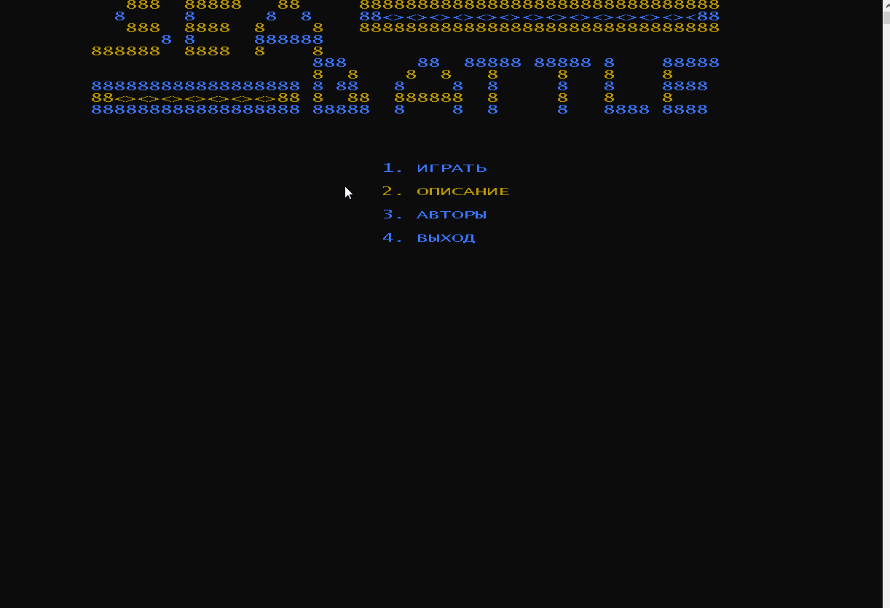
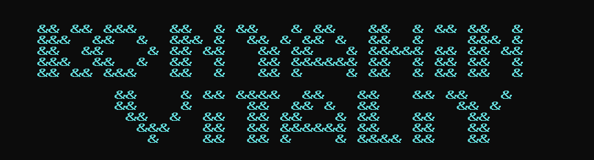

___

[](LICENSE)
[](https://www.codefactor.io/repository/github/itstep-vrn/seabattleconsole/overview/master)

+ **Год выпуска: 2019**
+ **Жанр: Стратегия**
+ **Разработчик : © Konyahin Vitaliy. wkrus@ya.ru**
+ **Платформа: PC Win 10**
+ **Тип изданий: Open Source**
+ **Язык интерфейса: Русский**
+ **Версия: 0.1 ноябрь 2019**
___
Консольная игра для Windows «Морской бой» написанная на языке C++ и рассчитанная на двоих игроков. 
___
### Необходимые компоненты:

Данная консольная игра корректно работает на Windows 10 в новой консоли. В старых консолях может работать не корректно.
___
### Как играть (правила классической игры):

Играют двое игроков.	
Правила морского боя говорят, что должно быть:
+ 4 корабля по одной клеточке (однопалубный);
+ 3 корабля по 2 клеточки(двухпалубный);
+ 2 корабля по 3 клеточки(трехпалубный);
+ 1 корабль — четырёхпалубный.
	
Корабли располагаются на игровом поле таким образом, чтобы между ними всегда был зазор в одну клеточку. Корабли могут касаться краёв поля и занимать углы.
 Когда корабли расставлены, игроки по очереди производят выстрелы :boom:, выбирая область в поле. Если выстрел:dart: пришёлся в не занятую кораблём область противника, то право хода переходит к сопернику. Если выстрел:dart: пришёлся в область, где находится корабль, стрелявший игрок получает право на ещё один выстрел.
___

##### Скачать игру: 
___
### Обзор игры:


___

### Авторы:

Konyhin Vitaliy.



___

### Описание кода программы:

##### Подключение библиотек:

``` c++
#include <iostream> //Библиотека ввода и вывода информации
#include <windows.h> // включает функции WinAPI
#include <cstring> // Для использования строк C++
#include <conio.h> // консольный ввод-вывод
```
##### Основные функции:

+ `void OkrasField(char map[][19], int color1, int color2, int color3, int color4, int color5, int color6, int x)` // Цвет игрового поля
+ `void menuBeckShip(string ship)` // Меню установки кораблей
+ `void OkrasLogoSea(char map[][55])` // цвет логотипа
+ `void funcBeckShip(char map[][19], int button1, int a, int b)` // Функция расстановки кораблей
+ `void LogoSea()` // Логотип морского боя
+ `void fViborSea(int count)` // Передвижение по меню Морской бой
+ `void moveField(char map[][19], int but)` //передвижение по полю
+ `void mapAutor()` // Функция отображения автора
+ `void mapInstr()` // Функция меню описания
+ `void OkrasAutorAndInstr(char map[][70], int color, int str)` // Окрашивание пункта Автор
+ `void drawingShips(char map[][19], int but)` // Отрисовка кораблей
+ `void outlineAroundShip(char map1[][19], char map2[][19], int ship)` // Отрисовка вокруг убитого корабля
+ `void outlineAroundShipInsaid(char map[][19], int ship, int numShip)` // Отрисовка вокруг убитого корабля внутреняя функция
+ `void winn(int numWin)` // Победа
+ `void eliminationSticking(char map[][19])` // устранение залипания курсора
+ `void CursorVisible()` // Скрыть видимость курсора
+ `void ConsoleWindow()` // Размер окна консоли и его отображение
+ `void printStuff(int x, int y)` // Обновление экрана
+ `void changFont()` // Смена шрифта  + размер шрифта
+ `void OkrasMenu(string vibor, int color)` // Окрашивание меню
